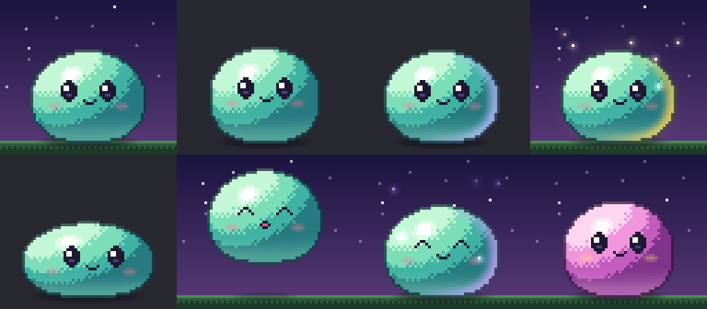

# HD overhaul — H0 spike

_Status: done · branch `feature/rpg` · see [brainstorm.md](brainstorm.md) §8_

**Goal:** prove the render-tier ladder works end to end: one pure pixel
renderer, several terminal encoders, and an HD buddy that moves like a game
sprite.



_Top row, left to right: idle on the night backdrop; idle on transparent; rare
rim light; legendary aura with motes. Bottom row: bounce anticipation crouch;
airborne stretch with happy face; epic landing squash; shiny palette._

## Try it

```sh
bun run gfx-demo                                # auto-detects the best tier
bun run gfx-demo --rarity legendary --shiny --bg
bun run gfx-demo --tier halfblock               # force: kitty | iterm | halfblock | ascii
BUDDY_GFX=kitty bun run gfx-demo                # same, via env
bun run gfx-demo --snapshot                     # print one frame and exit
bun run gfx-demo --png out/ --frames 60         # dump PNG frames (4×) and exit
```

Keys:

| Key | Action |
| --- | --- |
| `space` | bounce |
| `r` | cycle rarity |
| `s` | toggle shiny |
| `g` | toggle backdrop |
| `t` | cycle tier live |
| `q` | quit |

## What was built

| Module | Role |
| --- | --- |
| `server/gfx/framebuffer.ts` | RGBA framebuffer: blend, additive light, gradient, AA ellipse, nearest upscale, palette-indexed text sprites (`blit`) |
| `server/gfx/ease.ts` | Easing curves and a damped spring |
| `server/gfx/blob.ts` | The HD blob rig and pose math (see below) |
| `server/gfx/encode/halfblock.ts` | T1: `▀/▄/█` with truecolor or 256-color, SGR-deduped |
| `server/gfx/encode/kitty.ts` | T3: kitty graphics, zlib + 4096-byte chunks, stable image/placement id so frames swap in place |
| `server/gfx/encode/iterm.ts` | T3: OSC 1337 inline PNG (iTerm2, WezTerm) |
| `server/gfx/encode/png.ts` | Dependency-free PNG writer (also used for frame dumps) |
| `server/gfx/detect.ts` | Pure tier detection from env, the `BUDDY_GFX` override and tmux passthrough wrapping |
| `cli/gfx-demo.ts` | Interactive player (`bun run gfx-demo`, `claude-buddy gfx-demo`) |

**The blob rig.** The body is a lit jelly dome:

- A dome-top / flat-base superellipse.
- Lambert shading from a top-left light, quantized to a 5-step ramp, with
  ordered dithering in a narrow band only.
- Ground bounce light on the underside, a rarity rim light from behind-right,
  and a Blinn specular spot.
- A sel-out outline pass: each outline pixel is a darkened tone of the body
  pixel it borders.

The face is palette-indexed pixel sprites riding the body:

- eyes: open, half, closed, happy
- mouth: smile, open
- blush

**Motion** is all pose math:

- Breathing squash and stretch.
- Seeded blinks, sometimes doubled, plus glances.
- A bounce: anticipation crouch → stretched launch → eased fall → landing
  squash → spring wobble.

**Rarity:**

- uncommon and up: rim light
- epic: motes
- legendary: a gold aura and more motes
- shiny: a palette swap and twinkles

The whole renderer is `renderBlob(t, opts)`: pure and seeded, so tests can
hash pixels.

## Results

| Metric | Value |
| --- | --- |
| Render, 64×56 px (legendary + shiny + backdrop) | ~2.6 ms |
| Encode, half-block | ~1.6 ms, ~31 KB/frame |
| Encode, kitty (4× upscale, zlib) | ~1.3 ms, ~7.6 KB/frame (~230 KB/s at 30 fps) |
| Encode, iTerm2 (4× PNG) | ~1.6 ms, ~8 KB/frame (player caps iTerm2 at 15 fps) |
| Frame pacing | 30 fps held (fixed-timestep deadlines) |
| Tests | 33 in `server/gfx/gfx.test.ts`, including a full blob frame round-tripped through the half-block encoder pixel-exactly, PNG CRC/IDAT checks and kitty chunking/compression round-trips |

### Verification status

- **Half-block (T1) verified end to end.** The interactive player ran in a
  PTY, its byte stream was replayed through `@xterm/headless`, and the
  emulated screen was painted back to an image. It matches the renderer.
- **Kitty / iTerm2 (T3).** The escape sequences are unit-tested against the
  protocol specs, and the player emits them when switched live. They have
  **not yet been eyeballed in a real kitty, Ghostty, iTerm2 or WezTerm
  window**, which is the first thing to check. Open questions:
  1. Does re-transmitting with the same image id + placement id swap frames
     without flicker in each terminal?
  2. Does the terminal's scaling of the 4× image stay crisp?

## Learned / next

- A procedural body plus hand-drawn face sprites gets console-quality results
  fast. H1 should generalize this into the rig format: parts with pivots,
  some procedural (bodies) and some pixel (faces, limbs, gear).
- Half-blocks at 64×56 px are 28 rows: great in the quest player and too tall
  for the status line. H5 needs a 24×24 or 32×24 px cut.
- To do before H2:
  - A light-terminal grade: outlines are tuned for dark backgrounds.
  - A `reduceMotion` path.
  - Hooking `detect.ts` into `doctor`.
