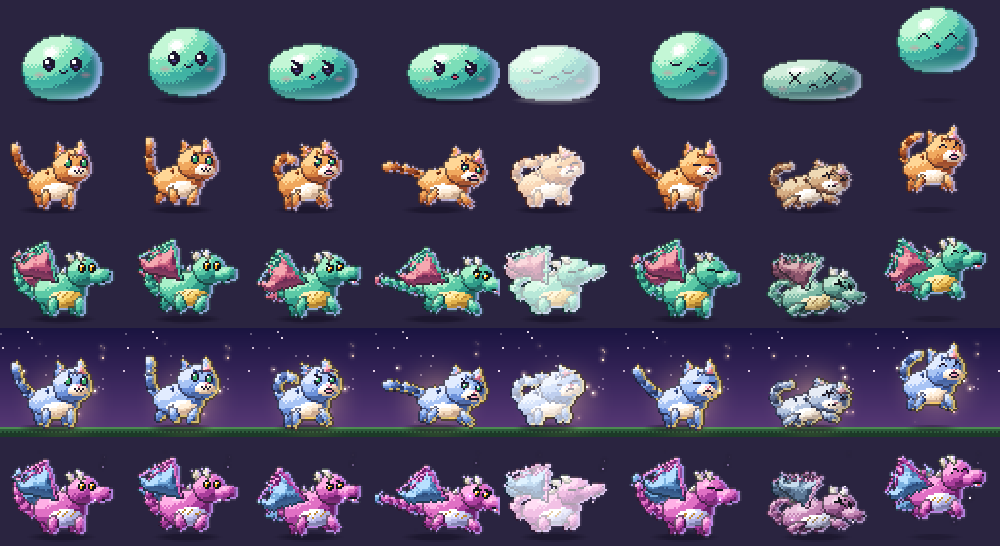

# HD overhaul — H1 rigs and motion

_Status: done · branch `feature/rpg` · see [brainstorm.md](brainstorm.md) §1 and §8_

**Goal:** prove the rig pipeline scales. Build one rig format, one motion
library and one lighting pass, then use them for three pilot species that
look like the same game.



_Rows: blob, cat, dragon (rare, with rim light), then a shiny legendary cat
on the backdrop and a shiny epic dragon. Columns: idle, walk, attack
wind-up, attack impact, hit flash, hit recoil, KO, victory hop._

## Try it

```sh
bun run gfx-demo --species cat
bun run gfx-demo --species dragon --rarity legendary --shiny --bg
bun run gfx-demo --png out/ --species dragon --anim attack --frames 30
```

| Key | Action |
| --- | --- |
| `1`–`6` | idle, walk, attack, hit, KO, victory |
| `space` | victory hop |
| `c` | cycle species (blob → cat → dragon) |
| `r` / `s` / `g` / `t` | rarity, shiny, backdrop, render tier |
| `q` | quit |

## What was built

| Module | Role |
| --- | --- |
| `server/gfx/rig.ts` | Rig format, 2D transform hierarchy, shape rasterizer, auto-shading, inner lines, sel-out outline, rim light, hit flash, KO tint |
| `server/gfx/motion.ts` | The six animations, written against part roles (`ANIM_INFO` gives loop, duration and the attack's impact time) |
| `server/gfx/species/cat.ts` | The reference rig: orange tabby, ringed 5-segment tail |
| `server/gfx/species/dragon.ts` | The showpiece: bat wings with struts, horns, plated belly, spiked back, spade tail |
| `server/gfx/blob.ts` | The H0 jelly blob, now driven by the same animation names and timings |
| `server/gfx/hd.ts` | Registry: `renderHd(species, anim, t, opts)`; returns null for species without HD art |
| `server/gfx/hd.test.ts` | Asset validator, engine and motion tests, golden frame hashes |

## How a rig works

A rig is a list of parts. Each part has:

- **A shape.** Big masses are primitives: an `ellipse` (a superellipse with
  `p` > 2 is boxier) or a `poly`. Details are a text `grid` with one material
  key per pixel, so the art stays readable in a diff. Eyes and mouths carry
  `variants` (open, half, closed, happy, x, angry; smile, open, frown).
- **A place in the hierarchy.** `parent` and `at` attach a part to its parent,
  and `pivot` is the point it rotates and scales around. Moving a head moves
  its eyes, ears and mouth.
- **A role.** `body`, `head`, `ear`, `tail`, `wing`, `legF`, `legB`, `eye`,
  `mouth` and so on. Motion is written against roles, so a new species with
  ears and a tail gets ear twitches and tail follow-through for free. `side`
  (-1 far, +1 near) and `seg` (tail segment index) shape the phases.
- **Draw order and shading hints.** `z`, plus `shade` to put far-side limbs in
  shadow and `group` to merge parts without an inner line.

## The style bible, enforced in code

Nothing is hand-shaded. `renderRig` lights every part the same way, so all
species stay consistent:

1. One top-left light. Ellipses get analytic dome normals; polygons and grids
   get pillow normals from a distance transform, so any silhouette reads as
   rounded. Normals rotate with their part.
2. Each material is a 4–5 step ramp (plus an optional shiny ramp). Shading
   quantizes to the ramp with ordered dithering only in a narrow band.
   `gloss` adds a specular spot; `flat` materials (eye ink, whites) stay crisp.
3. A part that overlaps one behind it, from a different group, gets a darker
   inner edge, so legs and heads read as separate masses.
4. A sel-out outline is drawn outside the silhouette, tinted by what it borders.
5. Rarity rim light on the back and bottom edges. A legendary aura and
   epic-plus motes come from the blob's effects.
6. The hit flash tints toward white; KO desaturates.

## Motion

`poseRig(rig, anim, t, seed)` is pure. The six animations follow the
principles in brainstorm §2:

| Anim | Beats |
| --- | --- |
| idle | breathing squash and stretch, head bob, seeded blinks and ear twitches, tail sway with per-segment lag |
| walk | diagonal leg pairs in opposition, body bob, faster tail |
| attack | coil back (anticipation) → stretched lunge → impact hold at 0.36 s → overshoot recovery; angry eyes, open mouth |
| hit | white flash, recoil on a damped spring, ears pinned, eyes shut |
| KO | hit, then the legs splay, the head droops, the body sinks; x eyes; color drains |
| victory | crouch → hop with stretch → landing squash; happy eyes, tail wag, wing flaps |

All timings come from `ANIM_INFO`, which the blob also uses, so mixed
species stay in sync in one fight. H2 hangs hit-stop, particles and the
defender's reaction off `ANIM_INFO.attack.impact`.

## Adding a species

1. Create `server/gfx/species/<name>.ts` exporting a `RigDef` on the 64×56
   canvas with ground at y 51, facing right.
2. Define materials as ramps, dark → light (`ramp("#...", ...)`), plus
   `shiny` ramps.
3. Build parts from primitives, then add grids for faces. Include every eye
   and mouth variant; the validator test fails on a missing one.
4. Register it in `RIGS` in `hd.ts` (`HD_SPECIES` is derived from it). Optional
   flavor goes in `feel` (float, servo, tempo, waddle, hop; see h6-roster.md).
5. Look at it with `bun run gfx-demo --species <name>`, or dump PNGs with
   `--png`.
6. Record the golden hashes: `GOLDEN=print bun test server/gfx/hd.test.ts`.

The cat took about 25 parts and the dragon about 30. Most of the work is
choosing proportions and palettes, not drawing frames.

## Also in this phase

- **`pikachu` → `sparkit`.** It's an original electric mouse with round ears
  and a zig-zag lightning tail. It keeps the same species index, so
  generation is unchanged, and saved buddies migrate on load.

## Next: H2

Swap the quest player's cell canvas for a framebuffer stage. Rigged
combatants get camera moves, hit-stop at `impact`, particles, damage ghost
bars, a battle transition and a victory card.
