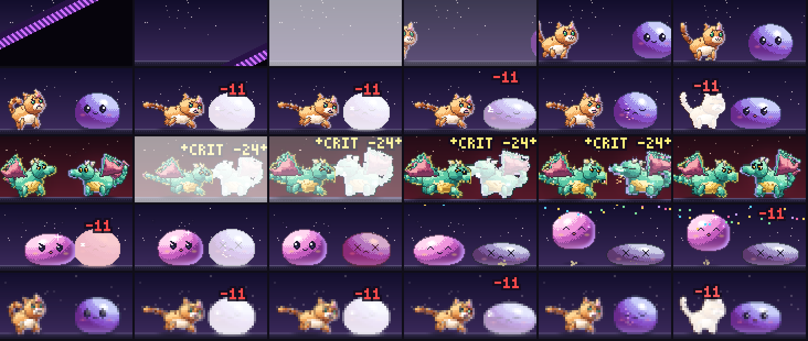

# HD overhaul — H2 quest player in HD

_Status: done · see [brainstorm.md](brainstorm.md) §2, §3, §5 and §8_

**Goal:** fights in `bun run play` render as HD pixel art on a framebuffer
stage with the "console game" feel, while the existing choreography stays
the source of truth for what happens and when.



_Rows: the encounter (wipe → flash → walk-in → ready); a strike on a
stand-in slime (wind-up → impact under hit-stop → sparks → recoil → the
foe's counter); a crit on the Segfault Dragon boss (camera push-in and
flash); a KO (collapse → victory hop and confetti); the same strike in the
half-block tier. Regenerate it with `bun run scripts/h2-sheet.ts`._

## Try it

```sh
bun run play                          # auto-detects the tier
BUDDY_GFX=halfblock bun run play      # force a tier: kitty | iterm | halfblock | ascii
BUDDY_GFX=ascii bun run play          # the old cell stage
```

The HD stage needs a buddy with HD art (blob, cat or dragon), a pixel tier,
`gameFeel` other than `off`, and a terminal of at least 66 × 34. Otherwise
the fight uses the ASCII stage, exactly as before.

## Pipeline

```
act() ─► Beat[] ─► direct() ─► Cue[] ─┬─► Stage.render()  (cell stage, unchanged)
                                      │
                                      └─► hdTimeline() ─► sceneAt(ms) ─► composeFrame() ─► encodeStage()
                                           segments,       one instant     Framebuffer        half-block lines,
                                           hit-stop,       of the fight    120 × 60 px        or a kitty / iTerm
                                           camera, shake,                                     image over a
                                           particles, bars                                    60 × 15 cell box
```

| Module | Role |
| --- | --- |
| `server/rpg/hdstage.ts` | Cast selection, the timeline (cue → animation segments, hit-stop, camera, shake, flashes, particles, ghost bars), scene rendering, tier encoding |
| `server/gfx/particles.ts` | Seeded, closed-form particles: sparks, dust, heal motes, poison bubbles, confetti |
| `server/gfx/font.ts` | A 3 × 5 pixel font for damage numbers and labels |
| `server/rpg/render.ts` | `battleFrames` / `battleScreen` take the HD path when `Paint.hd` is set; `hpBarFine` |
| `server/rpg/playkit.ts` | Lazy frames (`lazyTimed`, `memo`), the results card |
| `cli/play.ts` | Tier detection, gating, kitty image cleanup, the results card |

The director gained two hints the cell stage ignores: `StageState.hd.impact`
on the contact cue of every blow (who, damage, crit, heavy, ranged), and
`ActorState.act = "walk"` for the intro and flee. ASCII output is
byte-identical to before.

## Decisions

- **Fallback per combatant.** The hero must have real HD art: we never stand
  in for the player's own buddy. A foe without a rig is drawn as the HD blob
  recolored by a per-species hue (a "bug slime", `standInHue`), so a scene
  never mixes pixels and ASCII. Typo Gremlin, the Missing Semicolon, Kernel
  Panic and the Segfault Dragon appear as themselves. Stand-ins disappear as
  H6 adds rigs.
- **One box for every tier.** The scene is 120 × 60 logical pixels and always
  occupies 60 × 15 cells. Half-block draws it at half resolution (2 × 2 box
  downsample); kitty and iTerm send the full-resolution image and let the
  terminal scale it into the box. The layout is identical across tiers.
- **Text after the camera.** Pops are drawn into the output framebuffer after
  the camera and downsample (scale 1 in half-block, 2 in pixel tiers), so they
  stay crisp and readable.
- **Pixel images are placed after layout.** Pixel tiers reserve blank stage
  rows; `battleScreen` appends the image escape to the last stage row after
  the panel is measured. It moves the cursor to the box's top-left, sends the
  image (kitty `C=1`, iTerm `doNotMoveCursor`) and moves back, so the
  painter's clear-to-end-of-line never erases it. Kitty reuses one image id, so
  each frame swaps in place.
- **Timing is the director's.** Cue start times are unchanged. HD splits each
  cue into ~33 ms sub-frames that tween between the director's poses, and
  appends a short settle tail so one-shot animations finish before idle.

## Feel

| Effect | How |
| --- | --- |
| Animations | Per side, cues map to rig animations: an impact cue makes the defender play `hit` and the attacker `attack`; the attack's anticipation is time-warped so `ANIM_INFO.attack.impact` lands exactly on the impact cue. `x` eyes at 0 HP or a sink make `ko`, the winner plays `victory`, intro and flee `walk`. One-shots aren't cut off by idle. |
| Hit-stop | 60–120 ms at every impact, scaled by the share of HP the blow took (crits +25, heavy +12), never longer than the cue. A motion clock stops during the freeze; the shake keeps going. |
| Camera | Push-in toward the defender on crits (1.16×) and on boss heavy hits, the boss's landing and the full charge (1.08–1.1×), eased in and out. |
| Shake | Trauma-based (squared, decaying over 300 ms, smooth noise), capped at 3 px, on heavy and crit hits and on the cell stage's shake flags. |
| Flashes | Crit impacts, the boss landing and the end of the encounter wipe. Capped at one per 334 ms (3 per second). |
| Particles | Sparks fly away from the attacker as the freeze ends; dust on landings, KOs and flee; heal motes; poison bubbles; confetti on a win. |
| Marks | Guard and foe shields as light arcs, orbiting stun stars, a charge glow with `!!!`, enrage and boss auras, poison bubbles, `?` and `↑` tags. |
| HP bars | 1/8-cell precision. The lost chunk shows white for 120 ms, holds 250 ms, then drains over 300 ms. At rest the ghost is gone. |
| Transition | A diagonal stripe wipe, then a flash; the foe walks or drops in. |
| Results card | After a win: gold and XP count up, then the loot lands. |

## Accessibility and speed

| Setting | Result |
| --- | --- |
| `gameFeel: off` | ASCII stage, no animation (the speed default is `off`) |
| `gameFeel: subtle` | HD with the camera; no shake, no flashes |
| `gameFeel: full` | Everything |
| `reduceMotion: true` in config, or `BUDDY_REDUCED_MOTION=1` | HD art, no shake, flashes or camera moves (the env var also sets the speed to `off`) |
| speed `cinematic / normal / fast` | Every sub-frame is scaled like the cell stage's frames |
| speed `off` | No frames; the final screen (with the results card) is drawn directly |

## Performance

- A warm scene rasterizes in about 0.65 ms (test: ≤ 2 ms). Encoding adds
  about 0.8 ms for half-block and 0.6 ms for kitty.
- Actor frames are cached per (species, animation, 1/60 s, flip), with an LRU
  of 600 frames. A cold rig render is 2–3 ms, so frames are built **lazily**,
  when played: a turn's ~40 frames cost nothing until the player shows them.
- The HD idle loop is 13 frames at 200 ms, also lazy, and runs only inside
  the existing focus and 30 s idle budget.
- The zero-token `;` hook path never sets `Paint.hd`, so it never renders
  pixels (tested).

## Tests

`server/rpg/hdstage.test.ts`: fallback selection and stand-ins, feel gating,
cue → animation mapping (attack lands on impact, hit, KO, victory, intro walk,
flee), hit-stop bounds and the frozen motion clock, the camera and the flash
cap, the shake cap, stage composition (both actors, the mirrored foe, the
attacker drawn on top), tier box sizes and image placement, particle
determinism, font coverage, the ghost bar, screen heights, the hook path, lazy
frames, the results card, a perf budget, and golden hashes for five key frames
(`GOLDEN=print bun test server/rpg/hdstage.test.ts` to re-record).

## Not yet

- Hats and gear on HD rigs (rig anchors exist; H3/H6).
- Special-move cut-ins and boss phase cinematics (H6).
- Kitty's native animation (upload frames once and let the terminal play
  them) instead of re-sending each frame.
- The stage could shrink for shorter terminals instead of falling back.

## Next: H3

The UI kit: panels, bars, key prompts, banners and portraits across play,
the TUI and the shop. See [NEXT.md](NEXT.md).
