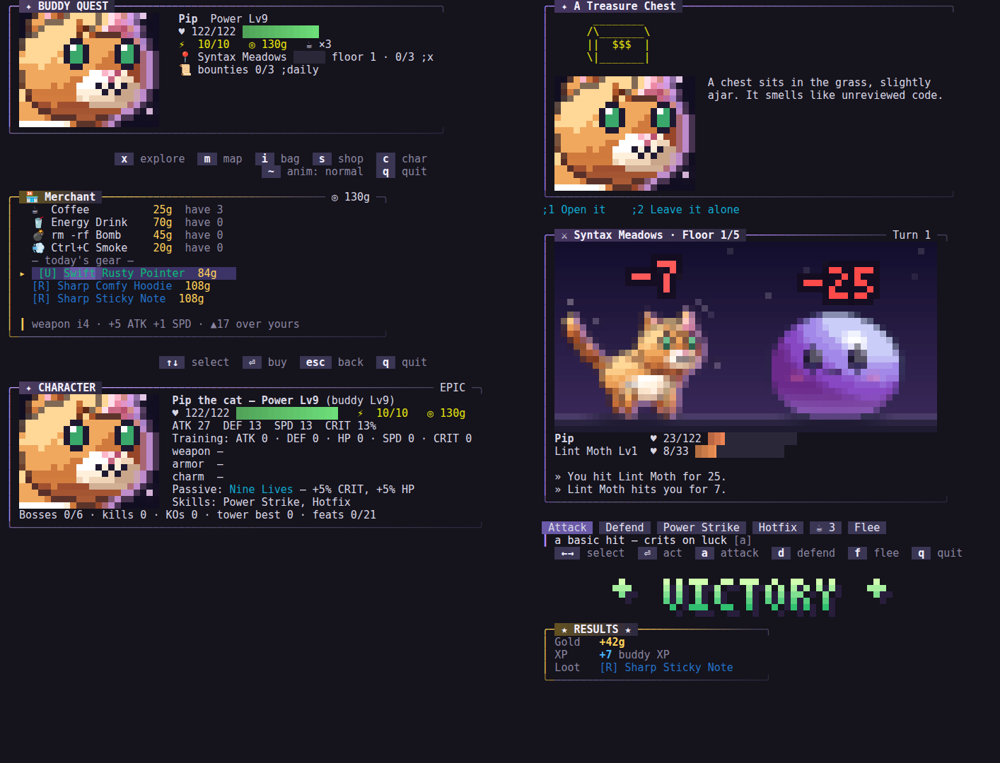

# HD overhaul — H3 the buddy UI kit

_Status: done · see [brainstorm.md](brainstorm.md) §4 and §8_

**Goal:** one visual language for the quest player, the Ink dashboard and
the shop: panels, bars, key prompts, menus, banners and portraits as a
shared, pure kit. The hook path stays byte-identical.



_Left: the town screen with the HD portrait and key chips, the shop as a
walkable menu (the cursor row has a highlight sweep, and the description pane
sits under the list), the character card. Right: an event as a dialogue box,
an HD fight with the kit's HP meters, the action bar and legend, the pixel
VICTORY banner and the results card._

## Try it

```sh
bun run play     # town, s shop, i bag, m map, c char — ↑↓ and ⏎ in menus
bun run tui      # the dashboard: key chips, stat meters, HD portraits on the buddy card
```

## Two faces, one kit

Every component renders one of two faces:

| Face | When | Looks like |
| --- | --- | --- |
| **Classic** | No `Ui` passed: the zero-token `;` hook, one-shot CLI output, tests | Exactly what the game printed before H3, byte for byte |
| **Rich** | `Paint.ui` is set: only `bun run play` (and the dashboard) on a terminal that isn't plain | Truecolor or 256-color gradients, pills, accents, pixel type, portraits |

The rich face keeps the classic layout: a rich panel has the same characters
as the classic one, only colored (tested with `stripSgr(rich) === classic`).
A plain terminal (`NO_COLOR`, `TERM=dumb`) gets the classic face in the TUI
too.

Byte-identity was checked two ways: the existing test suite, and a recorded
transcript of about 40 commands (plain, ANSI and animated) whose hash is
unchanged by H3.

## Components (`server/ui/`)

| Module | What |
| --- | --- |
| `color.ts` | `Ui` (`mode`, `motion`, `flash`), the `THEME` palette, rarity colors, `fg`/`bg` for truecolor or 256, `gradient`, `stripSgr` |
| `panel.ts` | The open-right panel. Rich: an accent left edge, a title bar on a band fading from the accent, a gradient top rule and a shadowed bottom rule |
| `meter.ts` | HP, XP, progress and stat meters at 1/8-cell precision. HP fills shift green → yellow → red and throb when ≤ 25%; the ghost shows lost HP (white for an instant, then dark red); the leading edge is brighter |
| `keys.ts` | `chip` (`⟨⏎⟩ confirm` classic, a filled pill rich), `legend` (flows chips, right-aligned), `parseHint` ("↑↓ navigate  ⏎ select" → items). Generic key glyphs only |
| `menu.ts` | Vertical menus (bouncing `▸`, highlighted row with a sweep, a fixed one-row description pane, a slot-in stagger) and the horizontal fight bar. `moveCursor` skips rows that can't be picked |
| `banner.ts` | "VICTORY" / "LEVEL UP" / "BOSS DOWN" in the 3 × 5 pixel font: four half-block rows with a vertical gradient and a drop shadow; plain `█▀▄` on T0. Opens from the center, then flashes (only when flashes are allowed) |
| `portrait.ts` | A bust (32 × 14 cells), face (22 × 9) or small (16 × 7) cut of an HD buddy, cropped around the rig's head part on a vignette. `t` lets it breathe. Null for species without HD art |

## Where it's used

| Surface | Rich face |
| --- | --- |
| Every quest panel | `render.panel` delegates to the kit; boss fights get a red accent and town / character screens the buddy's rarity color |
| HP bars | `hpBar` uses the meter (the HD stage's draining ghost from H2 now goes through the same component); the HD idle loop drives the low-HP pulse |
| Town | The HD face portrait (breathing with the idle loop) instead of ASCII; key chips replace the `;x explore…` footer |
| Shop, bag, map | Walkable menus. `↑↓` move, `⏎` buys, equips or travels. In the bag, `s`, `l` and `f` sell, lock and forge the row. Shop and bag reopen after an action, with the result as a toast and the cursor kept |
| Character sheet | A card: the face portrait beside the headline stats |
| Events | A dialogue box: the buddy's face beside the story, typed out 3 characters per frame |
| Fights | The action bar as highlighted chips with a `┃` description pane |
| Banners | The pixel-font banners replace the spaced-letter line |
| Results card | A kit panel with a gold accent |
| Title | The buddy's HD bust breathes under the logo |
| Footer | A right-aligned key legend for every mode (town, fight, menu, event) |
| Dashboard (`bun run tui`) | Key chips in the footer, kit stat meters and an HD portrait on the buddy card, plus **Game Feel** and **Reduce Motion** settings |

`cli/tui.tsx` now only starts the app when it is run directly, so its panes
can be imported and rendered in tests (Ink's `renderToString`).

## Accessibility

The same gates as H2. `Ui.motion` is off when the speed is `off` or
`gameFeel` is `off`: no slot-in, sweep, bounce or typewriter. `Ui.flash`
is on only for `gameFeel: full` without reduce-motion, so banners don't flash
otherwise.

## Tests

`server/ui/ui.test.ts`: the classic panel byte for byte, rich = classic once
stripped (truecolor and 256), meter widths and eighths, ghost colors, the
low-HP-only pulse, chips and the right-aligned legend, `parseHint`, cursor
skipping and wrapping, constant menu height, the description pane, slot-in,
`highlight` keeping text, the fight bar's two faces, banner size, T0 blocks,
the reveal and flash gating, portrait sizes, determinism and the null
fallback, rich shop/map/bag menus and their commands, portraits on the town
and character screens, the typed-out event, the rich results card, and a
sweep proving no `Ui` means no truecolor, pixels or menus.
`cli/tui.test.tsx`: the dashboard card shows a portrait for HD species and
ASCII otherwise.

## Not yet

- Skills, feats and the bounty board are still text lists, not menus.
- Portraits are always half-blocks, even on kitty and iTerm2.
- The title logo is still the hand-made block logo, not pixel type.
- Item "tilt-card" previews and the merchant as a rigged NPC (brainstorm §3.8).

## Next: H4

The buddy-shell diorama. See [NEXT.md](NEXT.md).
