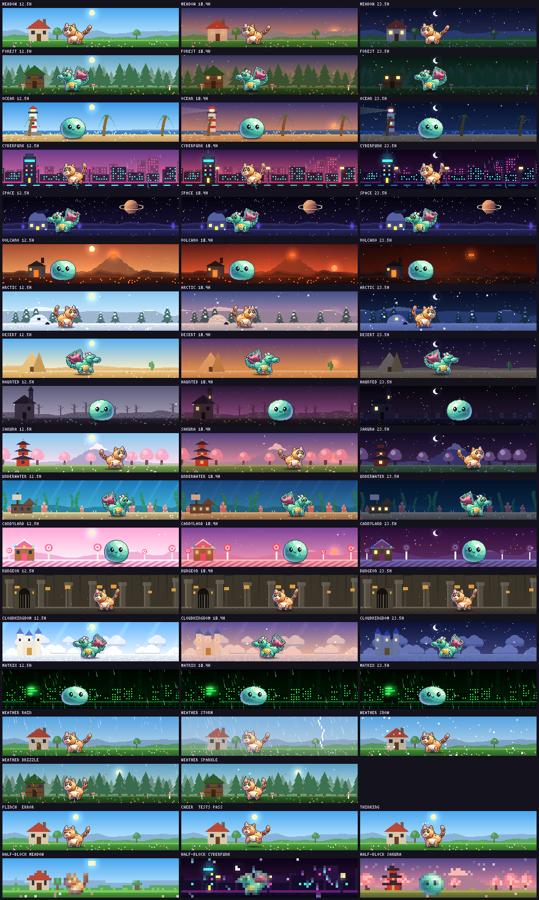
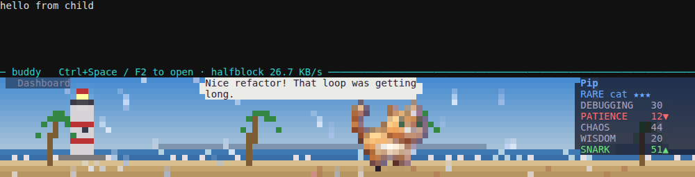

# HD overhaul — H4 the buddy-shell diorama

_Status: done · see [brainstorm.md](brainstorm.md) §3.2, §5 and §8_

**Goal:** the always-on wow. The buddy-shell panel becomes a small pixel
diorama: the buddy living in a parallax biome with a day/night cycle and
weather particles, reacting to Claude Code hooks, at near-zero cost while
idle.



_The 15 biomes at 12:30, 18:24 and 23:30 (kitty resolution, 4 × 8 px per
cell, a 72 × 8-cell panel). Then the weathers (rain, a storm mid-strike,
snow, drizzle, sparkle), the reactions (flinch on an error, cheer on passing
tests, the thought dots while Claude works), and the half-block tier of the
same panels. Re-render with `bun run scripts/h4-sheet.ts`._



_buddy-shell itself, half-block tier, 120 × 50: the ocean biome in the rain,
the name card on a translucent plate, a fresh reaction as a speech bubble.
Captured headless (`script` → pyte → Chromium)._

## Try it

```sh
bun run diorama-demo                              # the panel alone, poke it with keys
bun run diorama-demo --species dragon --biome volcano --hour 21
bun run buddy-shell                               # the real thing (Node + tsx)
npx tsx cli/buddy-shell.ts claude --biome sakura --hour 18.3 --weather snow
BUDDY_DIORAMA_STATS=1 bun run buddy-shell         # bytes/s in the separator
```

`diorama-demo` keys: `b` biome · `h` +1 hour · `w` weather · `s` species ·
`r` rarity · `e` error (flinch) · `p` tests pass (cheer) · `c` commit (nod) ·
`k` thinking · `m` reduceMotion · `f` gameFeel · `q` quit.

## The pipeline

```
 status.json ─┐         ┌─ paintSkyLayer            sky gradient, sun / moon, stars
 config.json ─┤ spec    ├─ paintLayer far/mid/near  parallax strokes, ground, landmark
 clock, hooks ┘ ──────► ├─ beatAt → buddySprite     wander, react, think (renderHd)
                        └─ paintFront(t)            weather + ambience, loops every 6 s
                                 │
                 cli/diorama-panel.ts: gates, pacing, byte budget, text overlay
                                 │
     kitty ── layers as images, panned by source rect, buddy frames swapped, weather loop
     iterm ── the composed picture as a PNG, 4 fps
     halfblock ── the composed picture as ▀ cells, only changed cells sent
```

| Module | What |
| --- | --- |
| `server/gfx/sky.ts` | Hour → day / dusk / night weights; blends a biome's three sky palettes, an ambient light multiplier (warm dusk, blue night), lamp level, sun and moon arcs. `hourOf(date, step)` quantizes the clock so slow layers re-render only when the light really changes |
| `server/gfx/scenery.ts` | Strokes in scene units (the panel is always 18 units tall, so one biome renders crisply at 1 px per unit in half-blocks and 4 in kitty) and in world x, so any layer pans seamlessly: ridges (seeded noise, snow caps), single peaks (Fuji, a lava-crater volcano), skylines (windows light up one by one at dusk), prop rows (17 kinds: trees, pines, blossoms, cacti, lollipops, kelp, coral, graves, pillars, lamps…), water, clouds, light rays, planets, ground textures, and landmarks built from unit rectangles with windows that glow at night |
| `server/gfx/biomes.ts` | The 15 biomes of `cli/biomes.ts` as data: sky palettes, far / mid / near strokes, ground, landmark, ambience (fireflies, leaves, petals, embers, bubbles, sparkles, neon drizzle, code rain). Space, dungeon and matrix pin their own hour |
| `server/gfx/particles.ts` | Weather fields: rain, snow, leaves, sparkles, embers, bubbles, fireflies. Closed form in `t`, seeded, and periodic: every particle makes a whole number of trips per `FIELD_LOOP` (6 s), so one loop can be uploaded once |
| `server/gfx/diorama.ts` | The spec, the light (overcast weather dulls it), the layers, lightning, the buddy's director and sprite, plates behind text, `composeDiorama` |
| `server/gfx/encode/cells.ts` | Half-block cells with text overlaid on the colors underneath, and a diff that sends only changed cells, never past the grid's rectangle |
| `server/gfx/encode/kitty.ts` | Adds upload-only, place (with a source rectangle), unplace, animation frame and loop commands |
| `cli/diorama-panel.ts` | Everything buddy-shell needs, testable without a PTY: gates, pacing, budget, overlay, reactions, the three placements |
| `cli/diorama-demo.ts` | The panel alone in the current terminal |

## The buddy

- **Wander.** Legs of 9 s: stand, then walk to a seeded spot in the zone
  between the landmark and the name card, with eased starts and stops,
  facing the way it walks. The camera follows loosely and the far, mid and
  near layers pan at 0.25, 0.55 and 1× (parallax).
- **Reactions** come from Claude Code hooks: buddy-shell watches
  `reaction.<session>.json` (what the hooks already write) and a new
  timestamp is an event. `error`, `test-fail`, `lint-fail`, `type-error`,
  `build-fail`, `merge-conflict`… flinch (the `hit` animation); `all-green`,
  `success`, `deploy`, `release`, `pet`, `recovery-from-*`, streaks cheer
  (`victory`); `commit`, `push`, `tag`, `branch`… nod.
- **Thinking.** While Claude streams output (not the echo of a keystroke:
  output within 300 ms of input doesn't count) the buddy stops and thought
  dots count up above its head.
- Reactions and thinking are **holds**: the wander clock stops during them,
  so the buddy freezes in place and the walk resumes where it left off. That
  keeps the director a pure function of (time, holds).
- A new speech bubble (the status `reaction`) shows for 20 s on a pale card.
- Species without HD art keep the ASCII panel.

## Day, night and weather

The light follows the real clock (`hourOf`, 5-minute steps): a sky gradient
lerp, a sun and a crescent moon on their arcs, stars, a warm dusk, lit
windows and skyline lights, and the lighthouse beam at night. Everything
standing in the scene is multiplied by the ambient light; far layers fade
toward the horizon color.

Weather comes from the living world. `writeStatusState` now adds
`sceneWeather` to status.json: the session's ground-weather window
(`rain` / `snow`, from the same `pickSessionWeather` schedule, but not
behind the `groundEnabled` floor opt-out), else the idle-FX weather
(`drizzle` on a rough error streak, `sparkle` on a clean streak), and
`storm` when rain meets an error streak. Rain, snow and storms dull the
light; a storm adds lightning, a flash and a forked bolt once per loop. It
also adds `gameFeel` (the effective, auto-quiet clamped level) so the
diorama gates the same way every other delight does.

## Placement

The child's region is never written. buddy-shell already renders the child
through xterm-headless into rows `1..code`; the diorama writes only rows
`code+2..rows`, always as absolute cursor moves inside `ESC 7` / `ESC 8`,
with no line feeds, and the half-block diff never writes past the last
column. Kitty images are clipped to the panel's rows. Tests check all of it.

| Tier | How | Text |
| --- | --- | --- |
| **kitty** (kitty, Ghostty, any kitty-protocol terminal) | Sky, far, mid and near are four images, uploaded when the light, size or weather changes (every 5 min at most). Far / mid / near are wider than the screen and are re-placed with a new source rectangle when the camera pans: parallax for ~60 bytes. The buddy is one cached image per (pose frame, sub-cell offset); the idle pose snaps to a cell so every idle spot reuses one set of frames (an LRU of 160). The weather loop is uploaded once, a few frames per tick within budget; in kitty itself (`TERM=xterm-kitty` / `KITTY_WINDOW_ID`) it's one animated image the terminal plays (`a=f` frames + `a=a` loop), elsewhere frames are swapped. All images sit at negative z, under the text | Plain text over a plates image (translucent cards) |
| **iterm** (iTerm2, WezTerm) | The composed picture as a PNG, 2 × 4 px per cell, sent when it changes, 4 fps | On the card's color, after the image |
| **halfblock** (everything else, tmux by default) | The composed picture at 1 × 2 px per cell as `▀` cells; each frame sends only the cells that changed | Overlaid into the cells, on the color underneath |

The existing repair hooks redraw it: alt-screen enter, clears and resizes
already call `setupPanel`, which now repaints the diorama in full. The 3 s
refresh diffs (status changes show within 3 s) and repaints in full every
30 s. The dashboard hides the kitty images first; exit frees them.

## Cost

Measured with `DioramaPanel` on a 120 × 50 terminal (a 120 × 9-cell panel)
over two minutes, counting the second minute. "Active" means a keystroke
every 2 s (full frame rate); "idle" means no input or output for 30 s
(half rate). After 5 minutes with neither, or when the terminal loses focus
(focus reporting, `?1004`), the panel stops animating: **0 bytes**.

| Tier | Weather | Mode | First paint | Steady | Render |
| --- | --- | --- | --- | --- | --- |
| kitty | clear | active / idle | 12 KB | 1.4 / 1.3 KB/s | ~2 ms |
| kitty | rain | active / idle | 47 KB + loop | 2.0 / 1.8 KB/s | ~2 ms |
| kitty (native loop) | rain | active / idle | 47 KB + loop | 1.4 / 1.3 KB/s | ~2 ms |
| iterm | clear | active / idle | 8 KB | 32.9 / 16.6 KB/s | ~4 ms |
| iterm | rain | active / idle | 10 KB | 41.3 / 20.8 KB/s | ~4 ms |
| halfblock | clear | active / idle | 10 KB | 23.7 / 13.9 KB/s | ~4 ms |
| halfblock | rain | active / idle | 12 KB | 46.6 / 37.5 KB/s | ~4 ms |

Kitty's steady cost is the buddy's frame swaps (a placement and an unplace,
~110 bytes, at 8 fps idle / 12 walking); the weather loop costs nothing once
it's up when the terminal plays it. Half-block weather is the expensive case
(every drop dirties cells), so half-blocks draw 0.3× the particles and
weather steps at 6 fps in every tier. A token bucket caps every tier at
**48 KB/s** (`BUDDY_DIORAMA_BPS` to change it): an over-budget frame is
skipped, and the cells it would have changed go out with the next one.
`BUDDY_DIORAMA_STATS=1` shows the live rate in the separator.

## Gates

| Setting | Diorama |
| --- | --- |
| `gameFeel` off | Today's ASCII panel |
| `gameFeel` subtle | Everything except lightning (no flashes; nothing shakes) |
| `gameFeel` full | Everything |
| `reduceMotion` | Still frames, repainted only when something changes: the buddy stands mid-zone in its idle pose (or a single reaction pose), weather is a still frame, no frame timer |
| Species without HD art, `NO_COLOR` / `TERM=dumb`, a panel under 7 rows (half-blocks) or 4 rows (pixels), `--no-diorama`, `BUDDY_DIORAMA=0` | Today's ASCII panel |

The effective `gameFeel` comes from status.json (so auto-quiet's clamp
applies), falling back to config.json.

## Tests

- `server/gfx/diorama.test.ts`: phase weights, sun / moon / lamps, warm dusk
  and blue night, overcast dimming, pinned hours; scene determinism; every
  biome renders opaque at every tier's density; **45 golden hashes** (15
  biomes × noon / dusk / night, `GOLDEN=print` to re-record); every field kind
  is deterministic and loops exactly every `FIELD_LOOP`; rain falls, embers
  rise; weather → fields; lightning only in storms and only with flashes;
  half-block density; the director (stays in its zone, faces its walk,
  reactions freeze and resume the walk, thinking stands still with dots,
  reduceMotion's still pose, hook reasons → reactions); crisp downscaling.
- `cli/diorama-panel.test.ts`: the gates (gameFeel off, non-HD species, ASCII
  tier, small panels, subtle / reduceMotion → no lightning); half-block
  placement (a full paint covers exactly the panel rows, later frames only
  touch panel rows, nothing changed → nothing sent, the text overlay, the
  byte budget); kitty placement (every placement starts at a panel row and
  ends inside it, sits under the text and keeps the cursor still; idle frames
  are placements, not uploads, at < 400 bytes a frame; the sky is re-sent
  only when the light changes; native loops vs swaps; hide and free; tmux
  passthrough); iTerm placement; pacing (12 fps, half rate idle, asleep
  after 5 min or unfocused, reduceMotion has no timer); reactions and
  thinking (echo ignored); cell diffs and `narrow()`.

## Not yet

- **Native animation for the buddy's idle loop** in kitty. Idle is
  ~1.3 KB/s of frame swaps today; uploading the idle cycle as one animated
  image per facing would make it ~0.
- Hats and gear on the diorama buddy (still the H2 loose end).
- Ground props from the living world (the sprout and pebble) as pixel art.
- Sixel. It must re-send every frame, so it would need the half-block diff's
  dirty-rectangle idea at the pixel level.
- The TUI's home screen could host the same diorama in an Ink "image slot".

## Next: H5

The status line in T1: baked half-block sprites with key-pose cycling, bash
unchanged except for the frame source. See [NEXT.md](NEXT.md).
