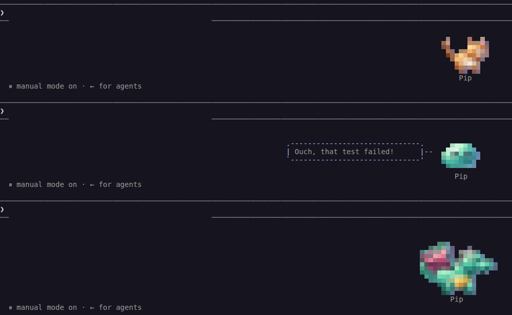
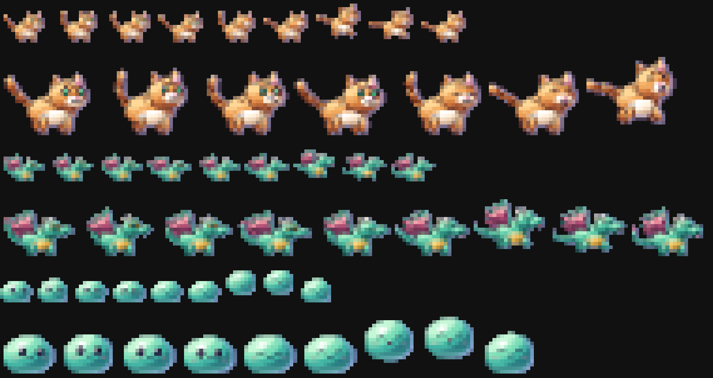

# HD overhaul — H5 the status line in T1

_Status: done · see [brainstorm.md](brainstorm.md) §5, §7.3 and §8_

**Goal:** HD reaches every user. The Claude Code status line shows the HD
buddy as truecolor half-block sprites. The server bakes them, and bash keeps
cycling strings exactly as before.



_Claude Code 2.1.289 running `statusline/buddy-status.sh`: a mini cat, a
mini blob flinching at a failed test next to its bubble, and a full dragon.
Captured from a real `claude` in a pty (an isolated HOME with onboarding
pre-accepted and a dummy API key, so no prompt is ever sent), then drawn
cell by cell (`script` → pyte → Chromium)._



_Every baked frame for blob, cat and dragon, mini and full: four idle
breaths, a blink (or the mood poses), then the four celebration poses._

## Try it

```text
/buddy sprite            report the setting
/buddy sprite full       ≈ 24 × 12 cells
/buddy sprite mini       ≈ 12 × 6 cells (default)
/buddy sprite off        the classic ASCII art
```

It's also `statusSprite` in `bun run tui` → Settings and in config.json, and
`bun run doctor` reports it ("Status-line sprite: mini → HD, 13×6 cells").

## Does Claude Code render it?

This was the open question in brainstorm §7.3. Claude Code 2.1.289 was run in
a pty with a test status line that prints `▀`/`▄` with truecolor fg + bg. Its
renderer re-serializes SGR (a `0;38;2;…;48;2;…` run comes out as separate
`48;2;…` and `38;2;…` sequences, and resets become `39`/`49`), but every
color pair and glyph arrives intact, and it draws all lines of a multi-line
status line. The status line already assumed truecolor (its rarity colors are
`38;2`), so the sprite adds no new terminal requirement.

## How it works

```
 writeStatusState ──► hdStatusSprite (cache: buddy-state/hd-sprite.json)
                        └─ bakeStatusSprite(look, size, mood, still)
                             renderHd × key poses → one crop box → solid pixels
                             → crisp downscale → encodeHalfblock (truecolor)
 status.json: hdFrames, hdSequence, hdWidth, hdCelebFrames, hdCelebSequence
 buddy-status.sh (one jq pass, as before): frame = hdFrames[hdSequence[NOW % len]]
```

| Piece | What |
| --- | --- |
| `server/gfx/statussprite.ts` | `bakeStatusSprite`: renders the key poses with `renderHd`, crops every pose (and the celebration hop) to one shared box anchored on the feet so nothing jumps, drops translucent pixels (shadows, glow fringes, which smear on light themes), downscales with the diorama's crisp box filter to fit 12 px (mini) or 24 px (full) tall, and encodes truecolor half-blocks. `keyPoses(mood)` picks the poses |
| `server/state.ts` | `statusSprite` config (`mini` default, `off`, `full`, coerced on load). `writeStatusState` bakes when the effective game-feel isn't off, the setting isn't off and the species has HD art, keyed on the same emotion the ASCII emote row uses. Bakes are cached on disk (the six newest), so a hook's status write costs ~1–3 ms after the first ~50–100 ms bake |
| `statusline/buddy-status.sh` | The config read gains `statusSprite`. The one jq pass re-gates on the *live* config (gameFeel off or sprite off → ASCII on the next tick, no server write needed), then picks the frame source: a fight's two-sprite scene, else the HD victory hop while a celebration is fresh, else the HD idle, else the ASCII flourish / idle as before. HD widens the art column through the same `ART_WIDTH` path the combat scene uses, centers the name under it, and skips the rarity tint (the rows carry their own color) |
| `server/index.ts`, skill, TUI, doctor | `buddy_sprite` (`/buddy sprite mini\|full\|off`), a Settings entry, a doctor row |

### Key poses at 1 Hz

The status line refreshes about once a second, so the sprite shows poses,
not motion. Each set has an 8-step (or shorter) sequence:

| Mood (from the active reaction) | Poses |
| --- | --- |
| neutral, bored | four idle breaths, then a blink |
| angry (error, test-fail) | the `hit` flinch twice, then four breaths |
| happy (pet) | two victory-hop poses between breaths |
| surprised (large diff) | a quick flinch, then breaths |
| celebration (level up, loot…) | four victory-hop poses, for the celebration's 6–10 s |

`reduceMotion` bakes one still pose (and one celebration pose).

## Sizes and cost

| Size | Cells (cat / dragon / blob) | status.json | Bytes printed per tick |
| --- | --- | --- | --- |
| off (ASCII) | 12 × 5 | ~1 KB | ~0.7 KB |
| mini | 13 × 6 / 12 × 6 / 9 × 6 | ~15 KB | ~2.1 KB |
| full | 25 × 12 / 20 × 9 / 15 × 9 | ~50 KB | ~6 KB |

A tick of `buddy-status.sh` takes the same ~108 ms with or without the
sprite here (it's dominated by process forks; the extra jq parse is lost in
the noise). Mini keeps about the ASCII art's footprint, which is why it's
the default. Full adds rows; the hop headroom degrades automatically when the
block would pass its 12-row budget.

## Compositing

- **Bubble, stats panel, name, title, badge:** laid out around the wider art
  column exactly as for the combat scene.
- **Wander:** the horizontal amble works unchanged (it moves the whole
  cluster).
- **Falling weather:** composites over the blank rows and columns around the
  sprite, but not over the sprite's own rows (`_wx_overlay` already skips
  rows that carry their own ANSI, as it does for the wyvern's flame).
- **Fights** keep their two-sprite ASCII scene. An HD fight in the status
  line is H6 material.
- **Shiny** buddies keep their HD shine (the rig's own sparkle) instead of
  the rainbow tint.

## Gates

| Setting | Status line |
| --- | --- |
| `statusSprite` off | ASCII, byte-identical to before H5 |
| `gameFeel` off | ASCII, byte-identical to before H5 (no frames are even baked) |
| `gameFeel` subtle / full | HD key poses (the sprite is the art, not a delight) |
| `reduceMotion` (or `BUDDY_REDUCED_MOTION=1`) | One still HD pose |
| Species without HD art, an older server without `hdFrames` | ASCII, byte-identical |

## Tests

- `server/gfx/statussprite.test.ts`: determinism; no sprite for non-HD
  species or `off`; mini ≤ 6 rows and full ≤ 12; every frame exactly the
  same box (each line `width` cells, ends in a reset, no control bytes);
  sequences index real frames; mood poses (flinch first when angry, hop when
  happy); reduceMotion's single pose; solid pixels only; golden hashes.
- `server/statusline_hd.test.ts`: the real `buddy-status.sh` shows every row
  of the right frame for the tick; `statusSprite` off, `gameFeel` off and an
  older server render byte-identical to the ASCII path; a fresh celebration
  shows the HD hop instead of the flourish; a fight keeps its scene; the
  name centers under the sprite; the bubble sits beside it. And
  `writeStatusState` in a child process: HD species get mini by default
  (cached on disk), full is wider, off / gameFeel off / non-HD species bake
  nothing, reduceMotion bakes one pose.

## Not yet

- The rest of the roster (17 species keep the ASCII art): H6.
- An HD fight scene in the status line.
- Hats and gear on HD rigs (H2's loose end) — the ASCII art shows hats today,
  the HD sprite doesn't.
- A 256-color variant for terminals without truecolor (the status line
  already assumes truecolor everywhere).

## Next: H6

The roster: the remaining species, the hatch cinematic, loot beams,
special-move cut-ins and boss cinematics. See [NEXT.md](NEXT.md).
