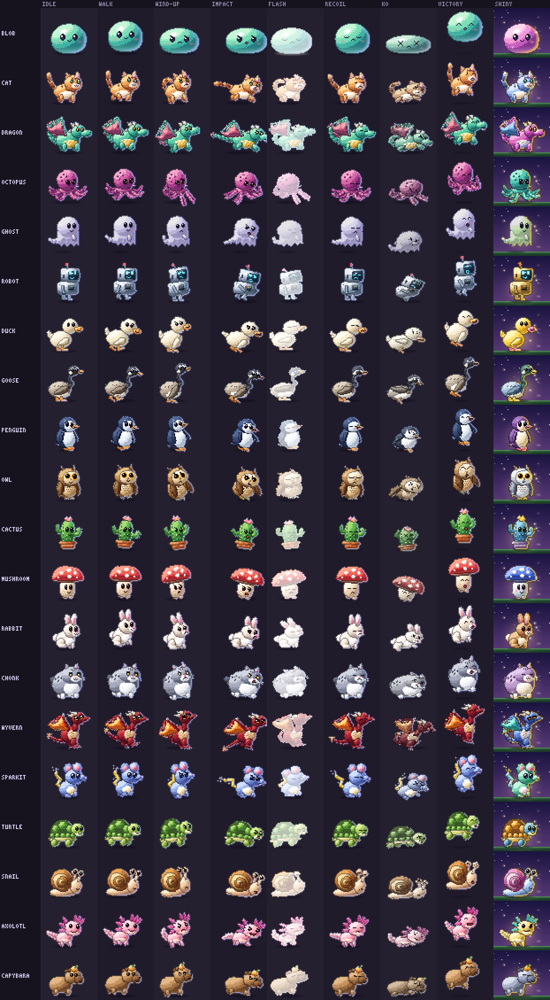
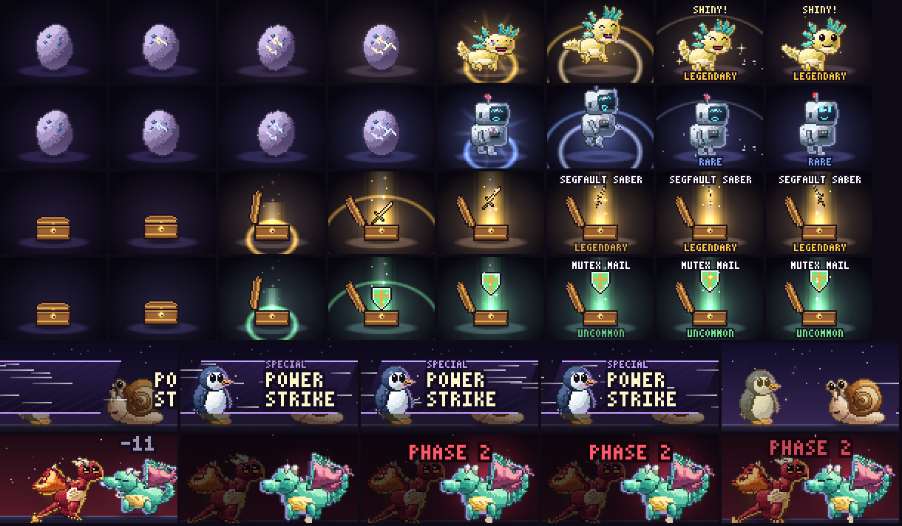

# HD overhaul — H6 the roster

_Status: done · see [brainstorm.md](brainstorm.md) §1, §3 and §8_

**Goal:** content complete. Every species is in HD, and the big moments
(the hatch, the loot reveal, special-move cut-ins and boss phase changes)
make the game feel like a console game.



_All 20 species. Columns: idle, walk, attack wind-up, attack impact, hit
flash, hit recoil, KO, victory hop, then a shiny legendary on the backdrop.
`bun run scripts/h6-sheet.ts [out.png] [--species a,b] [--scale n]`._



_Rows: a shiny legendary hatch (axolotl), a rare hatch (robot), a legendary
loot reveal, an uncommon one, a special-move cut-in in a fight, and a boss
phase change. Rendered at gameFeel subtle, so there are no flashes.
`bun run scripts/h6-cinema.ts [out.png]`._

## Try it

```sh
bun run gfx-demo --species octopus     # c cycles all 20 species
bun run diorama-demo                   # s cycles species in the diorama
bun run play                           # skills cut in; bosses change phase; drops open a chest
bun run cli/pick.ts                    # pick a result → the hatch, then naming
```

## The roster

The pilots were picked to stress the rig format, and each one added one small
engine feature. The other 14 needed nothing new.

| Pilot | Stress | What it added |
| --- | --- | --- |
| octopus | eight limbs | `PartDef.phase`: tentacles are `tail` chains with their own phase, so the shared sway becomes a ripple |
| ghost | no legs, see-through | `Material.alpha` (translucent ramps; the outline and shadow blend), `Pose.alpha` (shimmer), `feel.float` (hover and bob, sinks on KO) |
| robot | hard edges | high-`p` superellipses and polygons for corners; `feel.servo` snaps idle, walk and victory between poses |

**Species flavor is numbers, not frames** (`RigDef.feel`, brainstorm §1.1):

| `feel` | Species |
| --- | --- |
| `float` | ghost |
| `servo` | robot |
| `tempo` (< 1 slower) | turtle 0.6, snail 0.5, capybara 0.8, chonk 0.8, wyvern 0.9, sparkit 1.25 |
| `waddle` | duck, goose, penguin, cactus, chonk, wyvern |
| `hop` | rabbit (walk is a run of hops) |

Notes per species:

- **Birds** (duck, goose, penguin, owl) use `legB` for their feet and `wing`
  for folded wings or flippers. The goose's neck is a chain of detail
  segments with the head on the end.
- **Snail:** the eye stalks are `ear` parts with the eyes parented to their
  tips, so blinks and twitches ride the stalks.
- **Axolotl:** its gills are `ear` parts, three per side.
- **Cactus:** the trunk is the root. The pot rides along as a child, and the
  arms are `legF`.
- **Mushroom:** the cap is the `head`, and the face sits on the stem.
- **Chonk:** reads as different from the cat. It is a grey sphere with the
  head merged into the body and a smug face.
- **Wyvern:** a biped whose wings are its arms, so it reads differently from
  the teal dragon. It is crimson with ember membranes.
- **Sparkit** is an original periwinkle mouse with round ears and a gold bolt
  tail. It deliberately has no yellow body, no cheek circles and no
  black-tipped ears.

No other wiring was needed. `RIGS` in `hd.ts` is the registry and
`HD_SPECIES` is derived from it. The status line (`bakeStatusSprite`), the
diorama, the quest player, the portraits and the TUI card pick every species
up automatically. Foes in fights are now drawn as themselves; the
recolored-blob stand-in only remains for an unknown species. In the fight
stage, `HEAD_Y` keeps its hand-tuned values for the H1 pilots, and the rest
are measured with `topAt(species)`, the top opaque row of the rest pose.

The status-line `mini` sprite comes out 5–7 rows depending on the species'
proportions; `full` comes out 11–13 rows.

## The cinematics

| Moment | Where | Beats | Gates |
| --- | --- | --- | --- |
| **Hatch** (`renderHatch`, 3.8 s) | `pick` (choosing a result) and `hunt` (applying one) | The egg wobbles in three bursts, each wider and faster. Cracks appear in three stages, glowing in the **rarity's light**, which teases the outcome. Light leaks out, then beams, a squash and a shiver. The shell bursts: a shockwave ring, flying shards and a victory hop. The rarity name lands. **Shiny** adds a sparkle sting and "SHINY!" | Flash on the burst (full only); shake (full only); reduce-motion: no wobble or squash |
| **Loot reveal** (`renderLoot`, 2.8 s) | The quest player, after a fight that drops gear, before the rewards count up | The chest shakes harder and harder with light leaking from the seam. The lid pops (`easeOutBack`), a **rarity-colored beam** shoots up with a ring, and the item rises on it with motes drifting up. Epic and legendary items **spin**; legendary spins slowly. The name and rarity land | Legendary flash (full only); shake (full only); reduce-motion: no shake or spin |
| **Special-move cut-in** (`CUTIN_MS` 700) | HD fights, whenever a skill is used | A diagonal panel slams in from the attacker's side with the buddy's close-up (cut from the rig at the head). Speed lines streak across, the move name lands in big type ("SPECIAL" above it, wrapped onto two lines when long), and the panel exits the far side. The fight freezes underneath | full only (not subtle, not reduce-motion). Skippable: any key skips the turn's playback |
| **Boss phase change** (`PHASE_MS` 1100) | HD fights, when a boss first drops under half HP | The stage dims around the boss, a pulsing red glow swells behind it, the camera pushes in, "PHASE 2" lands, then the roar shakes the stage and kicks up dust | Shake (full only); camera (not reduce-motion). The dim and glow always play |

### How the fight cinematics plug in

`act()` records what happened and the director decides how it looks:

- **Beats** (`battle.ts`): a skill now emits `{ t: "special", id, name }`,
  which is never narrated. The boss's phase line is
  `{ t: "speech", phase: true }`.
- **Director** (`anim.ts`): these become **HD-only hints** on the next cue
  (`stage.hd.cutin` / `stage.hd.phase`), through the same channel as H2's
  impacts. The cell stage never reads them, so the ASCII choreography is the
  same, cue for cue. A test checks this.
- **Timeline** (`hdstage.ts`): `hdTimeline` turns a hint into a **hold**,
  real time inserted before that cue. A hold is also a freeze, so motion
  stops underneath. `sceneAt` exposes `cutin` / `phase` progress,
  `frameTimes` tiles the holds, and `composeFrame` draws the overlays at
  output resolution in every tier.
- **`HdFeel.cutin`** joins `shake`, `flash` and `camera`.

### How the hatch and loot play

- `server/gfx/cinema.ts` is pure: `render*(look, ms, feel)` returns a 72 × 56
  frame, and `cineFeel(gameFeel, reduceMotion)` is the gate.
- `cli/cinema.ts` is the player:
  - `cineSetup()` returns null on the ASCII path: gameFeel off, the ASCII
    tier, no TTY, or a terminal smaller than 74 × 30.
  - `playCinematic()` reserves a 72 × 28 box (inline, or at a fixed cell),
    paints at ~30 fps in half-blocks, or as one kitty / iTerm2 image upscaled
    4×, and supports `skip()`.

On the ASCII path, `pick`, `hunt` and `play` are exactly as before.

## Tests

- `server/gfx/hd.test.ts`:
  - the asset validator runs over every rig in `RIGS`
  - the registry equals `SPECIES`
  - every species renders every animation substantially, lunges at impact,
    flashes on hit (near-white buddies are capped at their headroom) and
    drains on KO
  - golden hashes for all 120 (species, anim) pairs; the H1 pilots' hashes
    are unchanged
- `server/gfx/cinema.test.ts`:
  - the gates
  - purity
  - the wobble (and none under reduce-motion)
  - crack color by rarity
  - the gated burst flash
  - the shiny sting
  - every species hatches
  - chest shake, beam, legendary-only gated flash, spin, slot icons
  - golden hashes
- `server/rpg/hdstage.test.ts`:
  - a skill is a special beat
  - the ASCII cues are unchanged by it
  - full has a 700 ms hold that freezes motion and subtle has none
  - frames tile the timeline
  - the boss phase holds, dims and shakes only when allowed
- The stage goldens were re-recorded, because the Indent Snail is now a snail.
- The fallback tests that used "a species without HD art" now use an unknown
  species.

## Loose ends

- The cut-in only plays for hero skills. Foe special moves could get one.
- The hatch plays inside `pick` and `hunt`. First-run onboarding (`install`)
  could use it too.
- `gfx-demo` could get keys that play the hatch and the loot reveal.
- Rig tuning:
  - the mushroom's feet barely show
  - the chonk's tail is short
  - the turtle is shorter than the rest (top at y 20)
  - the goose's S-curve is mild
- Everything left over from H2–H5 still stands (see NEXT.md).
