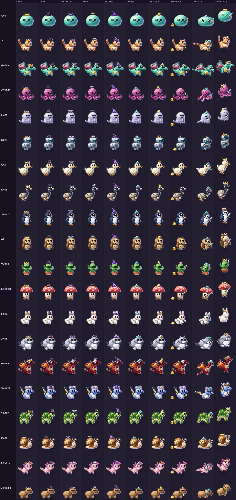
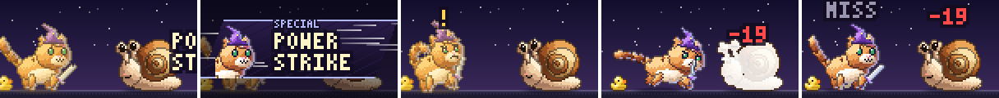

# HD overhaul — hats and gear on the rigs

_Status: done · a loose end from H2 and H5 · see [brainstorm.md](brainstorm.md) §1.1_

**Goal:** what the buddy wears and holds shows on every HD surface: the
status line, the diorama, quest fights (and their cut-ins), portraits and
the hatch. Brainstorm §1.1 says it should be "just more parts on the rig",
so every hat and weapon works on every species and every animation for free.



_All 20 species. Columns: the seven hats at idle; the Debug Wand with the
Rubber Duck; the Foam Sword at attack impact (with a beanie); a legendary
quest blade with a crown on the victory hop.
`bun run scripts/gear-sheet.ts [out.png] [--species a,b] [--scale n]`._



_A quest fight with a wizard-hatted cat holding an epic quest blade, its
rubber duck on the ground: rest, the Power Strike cut-in (the close-up
wears the hat), wind-up, impact, and the end of the turn.
`bun run scripts/gear-fight.ts`._

## Try it

```sh
bun run gfx-demo --species capybara    # e cycles hats, weapons and the duck
```

Equip something (`/buddy equip lucky_hat`, `/buddy equip debug_wand`) and
the status line, the buddy-shell diorama, the quest player and the TUI card
all pick it up. In the quest, an equipped quest weapon replaces the
idle-RPG one in the buddy's paw.

## What the buddy wears

| Gear | Where it comes from | HD art |
| --- | --- | --- |
| **Hat** | The innate `bones.hat`, overridden by equipped headgear (`resolveAppearance`): crown, tophat, propeller, halo, wizard, beanie, tinyduck | A pixel hat per kind. The propeller spins (four frames at 16 fps) and the halo floats above the head |
| **Weapon** | The equipped idle-RPG weapon, by its glyph: `/` Debug Wand, `†` Foam Sword (any other weapon glyph is drawn as a sword). In the quest, the equipped quest weapon wins | A wand with a star, a foam sword, or a steel **blade** whose guard glows in the drop's rarity |
| **Trinket** | The equipped trinket (`,>` Rubber Duck) | A rubber duck on the ground behind the buddy |

`hdGearOf(appearance)` turns a resolved appearance into `HdGear`, and
`renderHd(…, { gear })` draws it. Foes never wear gear.

## How it works (`server/gfx/gear.ts`)

- **Hats and weapons are rig parts.** `equipRig(rig, gear)` returns the rig
  with extra parts:
  - The hat is parented to the head at its crown.
  - The weapon is parented to the near front paw at its tip, tilted toward
    the foe.
  - A species with no front paw (birds, the octopus, the snail) holds the
    weapon at the front of its chest instead.

  So the hat bobs with the head, hops with the victory and droops on a KO,
  and the attack's reach swings the weapon. Gear gets the same top-left
  light, inner lines and sel-out outline as the body, so it looks painted
  in. Results are cached per rig and gear.
- **Anchors are measured**, not hand-placed: the crown of the head shape, the
  tip of the near paw, the front of the body. A rig can override them with
  `RigDef.anchors`:
  - the snail wears hats on its shell, since between the eye stalks they'd
    vanish
  - the capybara's hat replaces its yuzu (`hides: ["yuzu"]`, which also drops
    its children)
  - the cactus's hat replaces its flower and sits on the trunk
- **Headroom.** A hatted frame is `HD_HEADROOM` (16 px) taller, with its
  ground moved down to match, so the wizard's hat and the victory hop never
  clip. Every caller now aligns HD frames by the ground (`groundOf(fb)`),
  never the top:
  - the fight stage's `drawActor`
  - the diorama's buddy sprite
  - the hatch
  - the portraits
  - the cut-in bust
  - `gfx-demo`

  A test sweeps all 20 species × 7 hats × 6 animations for clipping.
- **The blob** has no rig, so `drawBlobGear` places the same sprites on its
  jelly body (`blobBody(t)`): the hat on top of the squash and stretch, and
  the weapon against its front.
- **Trinkets** rest on the ground behind the buddy, clear of where it stands
  at rest (so lunges don't shove the duck), and mirror for foes.
- **Materials** use Greek-letter keys, so they never collide with a rig's
  ASCII keys; a test enforces this.

## Surfaces

| Surface | What changed |
| --- | --- |
| Status line | `writeStatusState` resolves the gear (`status.json` gains `hdGear`), and the sprite bake wears it. The cache key includes the gear, and `HD_SPRITE_VERSION` is now 2. The scale comes from the bare buddy, so a hat adds a row on top instead of shrinking the sprite |
| Diorama | The panel passes `status.hdGear` into the spec. The buddy sprite is bottom-aligned, and the thought dots move up with the head |
| Quest fights | `Look.gear` comes from `loadBuddyCtx`, and `withQuestGear` puts the equipped quest weapon in the paw. `HdFighter.gear` is drawn bottom-aligned, and the cut-in close-up wears the hat |
| Portraits | Character sheet, town, dialogue boxes, TUI card: they wear the hat (not the weapon, since they're face shots) |
| Hatch | The buddy hatches wearing its innate hat (`pick`, `hunt`, `install`) |
| `gfx-demo` | `e` cycles every hat, then the weapon and trinket presets |

## Tests

- `server/gfx/gear.test.ts`:
  - glyph mapping
  - equip caching
  - hat parenting and headroom
  - material keys never collide
  - `hides`
  - every species wears every hat, which shows, keeps the ground line and
    never clips in any animation
  - weapons swing forward on the attack
  - trinket placement and mirroring
  - rarity blades
  - the propeller spins
  - golden hashes
- `server/gfx/statussprite.test.ts`: a hat keeps the scale and the feet, and
  only adds rows.
- `server/statusline_hd.test.ts`: `status.json` carries `hdGear` and the
  sprite wears it.
- `server/gfx/diorama.test.ts`: a hatted buddy keeps its feet on the same
  spot.
- `server/rpg/hdstage.test.ts`:
  - the cast carries the hero's gear
  - the quest weapon replaces an idle-RPG one
  - a hatted hero's feet are unchanged on the stage

No gear means no change: every existing golden hash is untouched.
