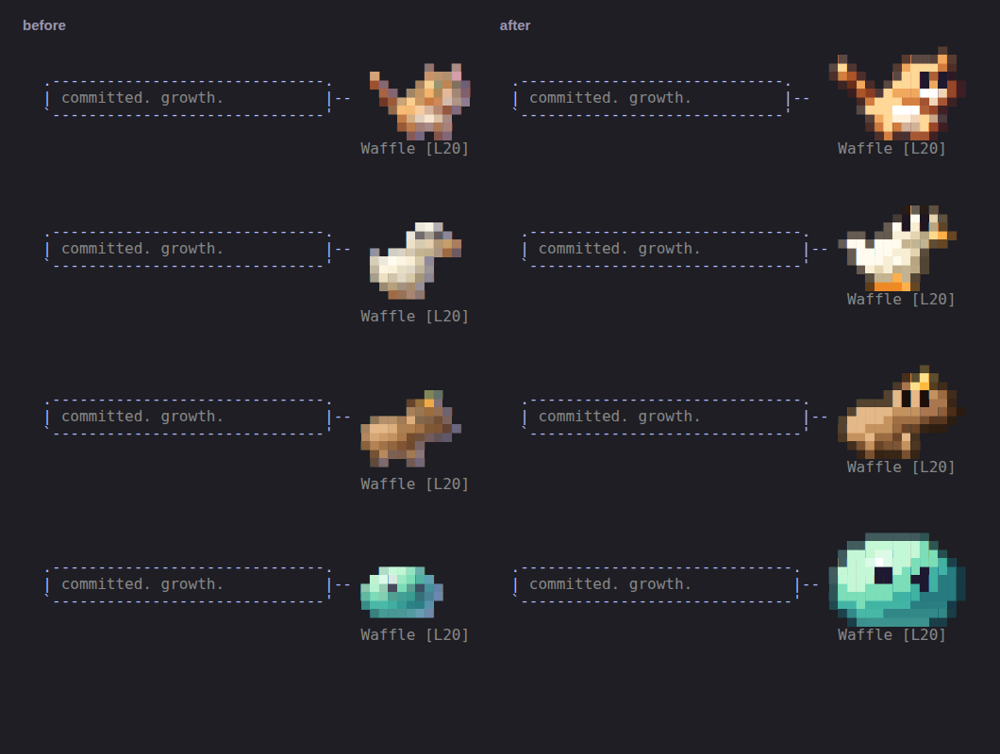
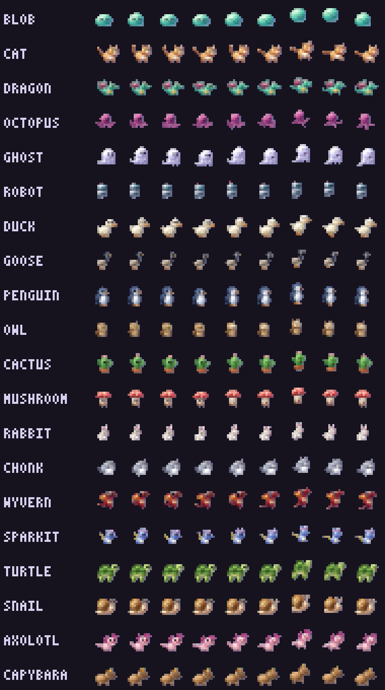
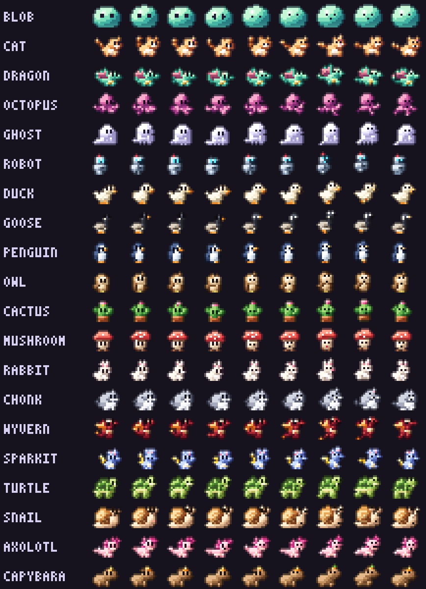
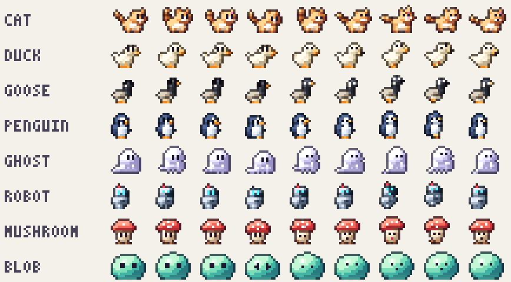

# HD overhaul — the mini status sprite, drawn at its own size

_Status: done · follows [h5-statusline.md](h5-statusline.md)_

**Goal:** the default status-line sprite (`statusSprite: mini`, ≈ 6 rows)
should look like pixel art drawn for that size, not a blurred thumbnail of
the 64×56 HD frame.



_The real `statusline/buddy-status.sh`, before and after, for a cat, duck,
capybara and blob (each one's idle frame for the same tick)._

| Before | After |
| --- | --- |
|  |  |

_Every species' baked mini frames (idle breaths, a blink or the mood poses,
then the celebration hop). `bun run scripts/mini-sheet.ts` re-renders the
sheet; `--light` draws it on a light terminal background:_



## Why it looked pixelated

H5 rendered the finished HD frame and box-averaged it by an integer factor
(usually 3–4×) down to ~12 px. At that size averaging destroys exactly what
makes a sprite read:

- **The outline** (1 px at HD size) averages into the fill, so the
  silhouette has no edge: a muddy halo on dark themes and a soft blob on
  light ones.
- **The eyes** (4–6 px ink grids) average into the fur. Most species had no
  face at all.
- **The shading** (a ramp with ordered dither) averages into in-between
  colors that aren't on any ramp, the "pixelated mush" look.
- **The integer factor and the hop headroom** wasted rows: most buddies came
  out 9–10 px tall, and some (duck, penguin, turtle, axolotl, capybara)
  needed a seventh row.

## How it works now

The rig renderer already knew more than pixels, so mini now draws from that
instead of from the finished frame:

```
renderHd ──► rasterRig   which part, material and normal each pixel is (no color yet)
              │
              ├─ full size: resolveRig  light, inner lines, rim, sel-out outline   (unchanged)
              │
              └─ mini:      shrinkRig   vote each small pixel's owner, keep its
                                        material, average its normals, redraw eyes
                            resolveRig  the same style pipeline, run at 12 px
```

| Piece | What |
| --- | --- |
| `rig.ts` `rasterRig` / `resolveRig` | `renderRig` split in two: rasterize (ownership, material keys, normals) and resolve (lighting, inner lines, rim, outline, flash/KO). `renderRig` is now `resolveRig(rasterRig(…))`, and every full-size golden hash is unchanged |
| `rig.ts` `shrinkRig` | Shrinks a raster by any real factor. Each small pixel samples 4×4 points: solid at ≥ 45 % coverage, owned by the part with the heaviest vote (faces outweigh fur: snout, horn and ear win ties), with that part's dominant **material** and averaged **normal**, so it's lit later, not averaged. Two pixel-artist passes: a lone pixel poking up from a round body or head (the crown of a shrunk ellipse) is trimmed, and **small eyes become designed dots**: a 1×2 ink column where the eye was, one pixel when the eye is a lid line (closed, half, happy), and two eyes always keep a pixel between them. Eyes big enough to survive (the blob's, the owl's) shrink like any part |
| `blob.ts` `blobRaster` | The procedural blob described as a rig raster (dome, two eyes, mouth), so it goes through the same path |
| `hd.ts` `rasterHd` | `renderHd`'s pre-lighting twin: the posed, geared rig as a raster, plus the gear renderHd draws as pixels (the trinket; the blob's hat and weapon) as layers |
| `statussprite.ts` `bakeMini` | Picks the scale from the bare buddy's **tallest single pose** (11 px tall plus a 1-px outline row = 12 px = 6 rows), so the hop no longer costs resolution: a pose that would rise past the headroom is lowered into it (a 1–2 px hop still reads at 1 Hz). Long buddies give up a little height to stay ≤ 16 cells wide. Feet sit on the bottom row. Resolves with mini settings (below) and encodes truecolor half-blocks as before |

### Mini style settings

The same style pipeline as every HD surface, tuned for 12 px:

| Setting | Full size | Mini | Why |
| --- | --- | --- | --- |
| Dither | ordered (Bayer) | off | at 12 px a dither pattern is noise |
| Inner lines | 0.55 | off | nearly every pixel borders another part; lines darkened everything |
| Darkest ramp step | used | reserved for the outline | dark shading pixels read as holes |
| Ambient light | 0.22 | 0.34 | small sprites read better a little brighter (the wyvern was mostly maroon) |
| Rarity rim light | on | off | it covered half the pixels; the status line already colors the name by rarity |
| Contact shadow | on | off | the status line never showed it (translucent) |

## Sizes

| | Before | After |
| --- | --- | --- |
| Rows | 6–7 | always 6 |
| Width (cells) | 7–13 | 9–16 |
| Buddy height | ~9–10 px of 12 | 11 px + outline |

`full` is unchanged (it still uses the H5 box filter at 2×, where the
averaging is mild); the same pipeline could serve it later.

## Tests

`server/gfx/statussprite.test.ts`: every species fills exactly 6 rows within
16 cells with feet on the bottom row; every row's leftmost pixel is darker
than the one inside it (the sel-out outline; the H5 thumbnails fail this) and
the cat's frame carries its eye ink; `shrinkRig` turns the cat's eyes into two 1×2 dots at least two
columns apart, which drop to one pixel each on the blink; new golden hashes
for mini (full unchanged). `server/gfx/hd.test.ts` goldens prove the
raster/resolve split renders every full-size frame byte for byte as before.

## Not yet

- Dark species on dark terminals (the goose's black neck) have no light edge
  to separate them from the background. A light-theme-aware outline would
  need to know the terminal's background color.
- `full` could move to the same pipeline (its 2× box filter blurs less, but
  it still drops the outline to ~1 px of mixed color).
- A sextant (2×3 per cell) tier would triple the pixel count in the same
  footprint, but fonts and terminals draw those glyphs unevenly, so it would
  have to be opt-in.
